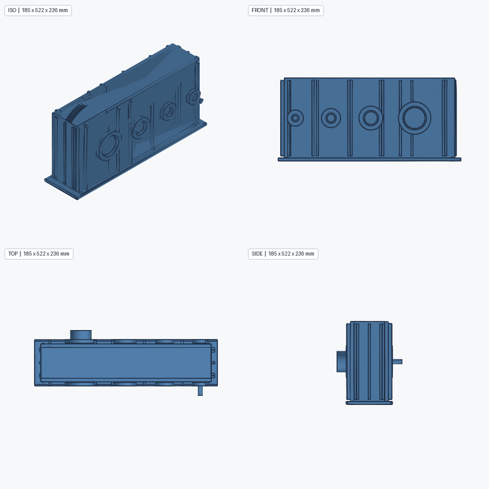
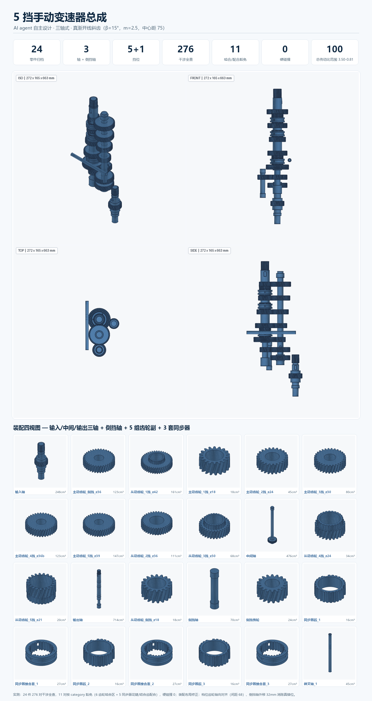
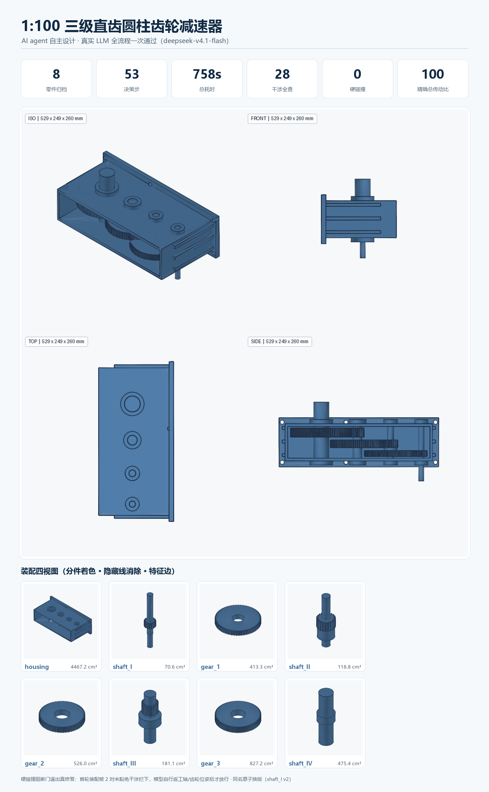
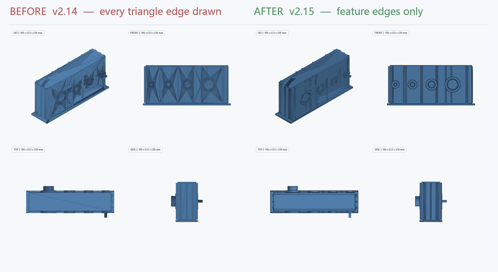
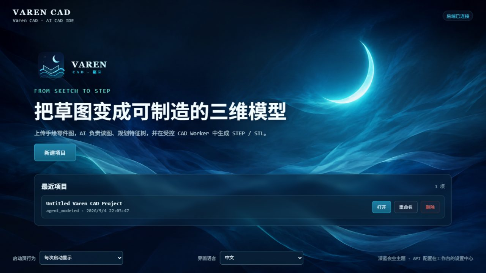
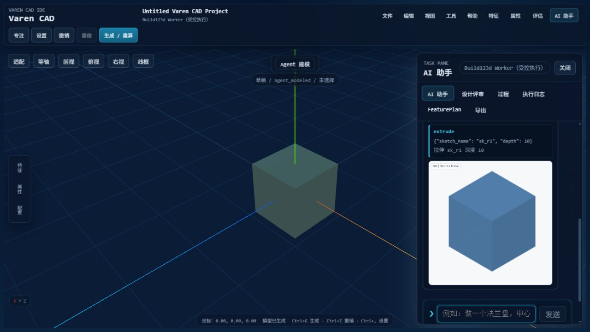

# Varen CAD —— AI CAD IDE

<p align="center">
  
</p>

> **把草图变成可制造的三维模型。** Varen CAD 是一个面向机械工程师的 AI 建模 IDE：
> AI agent 像工程师一样逐步自主建模，你随时看进度、改参数、确认关键决策，
> 并保留参数化特征历史、精确 BRep 几何与可重放历史。

<p align="center">
  <b><a href="https://vanyu0710.github.io/aicad/">🌊 产品落地页</a></b> &nbsp;·&nbsp;
  <a href="https://vanyu0710.github.io/mechcad-kernel/">内核文档</a> &nbsp;·&nbsp;
  <a href="docs/USER_GUIDE.md">用户指南</a>
</p>

<p align="center">
  一句话跑出的 1:100 三级齿轮减速器装配（AI agent 自主设计，8 件 / 758s 一次通过）：<br/>
  
</p>

<p align="center">
  5 挡手动变速器总成（三轴式 · 真渐开线斜齿 β=15° · 24 件 / 硬碰撞 0）：<br/>
  
</p>

<p align="center">
  1:100 三级减速器运行总览（8 件 / 53 步 / 758s / 硬碰撞 0）：<br/>
  
</p>

<p align="center">
  内核证据渲染器 v2.15：只画特征边，平面扇形三角化的对角噪声全部消失 ——<br/>
  
</p>

<p align="center">
  
  
  
  
  
</p>

> ⚠️ **License**：本项目仓库当前未附带 LICENSE 文件；所依赖的 CAD 内核
> [`mechcad-kernel`](https://github.com/vanyu0710/mechcad-kernel) 采用 **AGPL-3.0-or-later**。
> 若你计划闭源分发，请先处理内核许可证问题。

---

## 目录

- [它是什么](#它是什么)
- [怎么运行](#怎么运行)
- [使用流程](#使用流程)
- [架构总览](#架构总览)
- [目录结构](#目录结构)
- [功能矩阵](#功能矩阵)
- [AI 集成](#ai-集成)
- [开发与测试](#开发与测试)
- [API](#api)
- [文档](#文档)
- [被冻结的旧链路（FeaturePlanV3）](#被冻结的旧链路featureplanv3)

---

## 它是什么

Varen CAD 把 **MechKernel 参数化 CAD 内核**（真实 OCC 7.9.3 几何）接到一套
**FastAPI + React + Three.js** 的 IDE 上，产品形态是 **"CAD 领域的 Codex"**：

```
你的一句话/草图（对话式会话，运行中可插话）
   │
   ▼
┌──────────────────────── AI Agent（harness）────────────────────────┐
│  LLM 原生 function calling 逐步调用内核 34 个公开 op                │
│  每步: 观察 → 决策(工具调用) → 执行 → 读回 StepResult → 自修复       │
│  流式: 模型文字 token 级 SSE → WS agent_text_delta → 打字机          │
│  会话: 每项目一条持久会话（/agent/message + /agent/session）         │
│  提问: ask_user 结构化问题卡片（单选/多选/文本 + 自动"其他"）        │
│  计划: 计划模式下 propose_plan 出分步计划 → 审批 → update_plan 进度  │
│  人在回路: 破坏性操作/提问 → 审批卡 → 批准/改参/拒绝               │
│  vision: 任务消息可携带草图图片（OpenAI blocks / Anthropic 转换）    │
└───────────────────────────────┬────────────────────────────────────┘
                                │ stdio JSON-lines RPC (子进程)
                                ▼
┌────────────────── MechKernel (mechcad-kernel 仓) ───────────────────┐
│ 参数化特征历史 feature_graph · _op_history · select 选边/选面        │
│ 任意方向孔/面上草图 · 测量 · 导出 STEP/STL · 事务 undo/redo          │
└──────────────────────────────────────────────────────────────────────┘
```

**不是"让 AI 写任意 Python"**。执行层被严格约束在 34 个经验证的公开 op 上，
每步都有结构化反馈（`StepResult`）与几何验证，失败可自动修复或回退。

## 界面预览（v0.10.0-alpha 实测截图）

**启动页** —— 深蓝夜空品牌主页，后端连接状态、最近项目、新建入口一目了然：



**主工作区 + 对话式 AI 助手** —— 3D 视口实时渲染内核几何，右侧 AI 抽屉就是一条持久会话：
用户消息、助手流式文字、每个内核工具的卡片，以及几何变化时自动内嵌的**可视化快照**都留在会话流里：



---

## 怎么运行

### 推荐：Windows 产品模式（桌面启动）

首次运行会自动构建前端，并在桌面创建 `MechCAD IDE` 快捷方式（脚本沿用旧名，见 `scripts/mechcad-tray.ps1`）：

```powershell
.\start-mechcad-pro.cmd
```

之后双击桌面快捷方式即可。FastAPI 会同时托管前端、API 和 WebSocket：
打开 `http://127.0.0.1:8001/`。系统托盘提供"打开界面 / 重启服务 / 打开日志 / 退出"。

可选参数：

```powershell
.\start-mechcad-pro.cmd --no-browser
.\start-mechcad-pro.cmd --port 8080
.\start-mechcad-pro.cmd --skip-shortcut
```

环境变量：`MECHCAD_PORT`、`MECHCAD_OPEN_BROWSER`、`MECHCAD_LOG_DIR`。

### 开发模式（Vite + FastAPI 双进程）

```powershell
.\start-mechcad.cmd          # 访问 http://127.0.0.1:5173/
```

手动启动：

```powershell
# 后端 (Python 3.12 venv)
.\.venv\Scripts\Activate.ps1
pip install -r requirements.txt build123d==0.11.1 cadquery-ocp-novtk==7.9.3.0
.\.venv\Scripts\python.exe -m backend.main

# 前端 (另一个终端)
cd frontend
npm install
npm run dev
```

> ⚠️ 需要 MechKernel 内核。Varen CAD 的 agent 通过 stdio RPC 调用
> `mechcad-kernel` 仓的子进程 `mech_kernel/server.py`。
> 默认假设内核在 aicad 旁的同级 `mechcad-kernel` 目录，可用
> `MECHCAD_KERNEL_REPO` / `MECHCAD_KERNEL_PYTHON` 覆盖（见 `.env.example`）。

---

## 使用流程（v0.12 多零件 harness）

1. **打开界面**，`新建项目`。
2. 在右侧常驻的 **AI 助手** 会话列直接下指令（如"120×120×12 法兰，中心 Ø30 通孔，6 个 Ø8 螺栓孔在 Ø90 圆上"，
   或"给我设计个 1:100 的变速箱"）；点输入框左侧 **＋** 可附草图（首条消息自动带图，vision 进 agent 上下文）。`Ctrl+G` 聚焦输入框。
3. **多零件/机构级任务（变速箱、减速器等）自动进入计划模式**，agent 先像工程师一样**调研**：
   `design_calculate` 做传动比分级、齿轮副几何/中心距、轴径初估、壁厚估算（内置 kind 不够可提交纯算术代码进沙箱），
   调研计算在会话流里以卡片可见。
4. Agent 在**会话流**里工作：模型文字**逐字流式**显示，每个工具调用是一张内嵌卡片（op / 参数 / 结果），
   几何变化时自动内嵌**可视化快照**；3D 视口随之刷新。
5. **运行中也能插话**：聊天框始终可用，消息排队后在当前步骤结束、下一轮模型决策前生效。
6. 关键信息不明确时，Agent 弹出**结构化提问卡片**（单选 / 多选 / 文本，附"其他"自定义），你点选或填写即可；
   需要破坏性操作（删除特征 / confirm_replace 替换 / 抽壳）时弹**审批卡**：**批准 / 改参 / 拒绝**，
   超时（默认 600s）视为拒绝并告知模型不要重试。
7. **BOM 计划审批**：调研+提问后 agent 出 `propose_plan` 计划——**要几个零件、分别是什么、关键参数**（零件清单）
   + 按零件分组的建模步骤，你在**计划审批卡**上"批准 / 要求修改"；批准前不得改几何（harness 硬门控）。
8. 批准后**逐件建模**：一个内核会话只装一个零件。复杂零件（箱体/阶梯轴/孔阵列）用 **`run_build_script`
   代码通道**——模型写 Python 脚本一次成型（几何仍只能走内核 `k` 门面公开 op，失败自动回滚并回传原始
   traceback，脚本 op 照常进特征历史可参数重放）。建完一件调 `finish_part` → 过**单实体 + 特征契约**两道
   机器复检（断言"半径×数量"的圆柱面实测吻合才放行，防悬浮特征与谎报）→ 自动导出该件
   `part_NN_名称.step/.stl` 归档、计划打勾、清空会话开下一件；每步有 `StepResult` 回读与四视角快照，失败自修复。
9. 特征树 / 属性 / 评审 / 过程 / 导出在**底部结构抽屉**：可点选特征、**改参数**（参数化重放）、**删除特征**，支持内核级撤销/重做。
10. **交付**：产物区提供零件级 STEP/STL 逐个下载 + execution_report（含调研计算转录、BOM 归档清单、假设与需复核项）；
    单零件任务收尾自动 `validate_geometry` + 导出整件 STEP/STL。齿轮零件用内核 `make_gear` 真渐开线齿形，不造假。
11. **装配（v0.14 F2a）**：全部零件归档后 agent 调 `export_assembly`——按 BOM 位姿生成**多实体装配 STEP**
    （XCAF 具名产品树）+ 全对干涉报告（可豁免设计意图内重叠）+ 分件着色四视角预览；视口自动切装配模式
    （多件按位姿叠加、可显隐/点选高亮），产物区出现装配面板。零件库在 `work/project_parts/{项目}/`（版本化 + manifest）。
12. **会话持久化**：每项目一条 agent 会话（`work/agent_sessions/{id}.json`，含计划与零件库镜像），重开可回看；
    随时**暂停接管**（停止 agent → 手动编辑 → 发消息继续，新任务消息自动携带最新特征上下文）。
13. **可靠性硬门控（v0.15 P0 修复）**：成功由程序判定不由文字判定——无产物/计划未完成/strict 验证不过/步数耗尽一律 ok=false + error_kind；finish_part 过 strict 几何验证才归档；工具结果结构化裁剪（不字符串化、数组截断附 total）；几何更新按指纹而非体积；run_build_script 任一 op 失败即整体回滚（SCRIPT_OP_FAILED + failed_op）
14. **七模块系统提示词（v0.15）**：角色/建模原则/工作流程/API 规范/验证/修复/输出格式结构化重写（中英同步），结构由测试锁死；BOM 参数表（key_params）与 SUCCESS/PARTIAL/FAILED 三态由程序判定；`MECHCAD_PROMPTS_FILE` 支持提示词 A/B 基准（scripts/ab_prompt_housing.py）
15. **几何语义闭环（v0.16）**：同名返工原子换版、BOM 为装配事实来源（计划外零件名 BOM_UNKNOWN_PART 拒绝、历史残留标 superseded 排除）；未豁免硬碰撞阻断导出（INTERFERENCE_BLOCKED），豁免须声明 category fit|mesh；feature_contract 支持孔语义契约 {type: through_hole|blind_hole, diameter_mm, count, positions}——外凸台冒充通孔被内核分类器直接拒绝。
16. **变速箱最新全流程实测（v0.16 代码）**：真实 LLM 53 步 / 758s 一次通过——8 件（3 真渐开线齿轮 + 4 阶梯轴 + 箱体，全 script 件）逐件过 strict 验证与孔语义契约，装配 28 对干涉全查、2 对啮合区按 category=mesh 豁免、硬碰撞 0；首轮曾被硬碰撞门拦下并自行返工轴/齿轮位姿（同名原子换版）。

---

## 架构总览

```
┌──────────────────────────── React IDE (保留壳) ────────────────────────────┐
│  Three.js 视口(STL) · 特征树(feature_graph) · 属性面板(改参数→重放)         │
│  Agent 运行条 · 审批面板(approve/edit/reject) · 撤销/重做                   │
└──────────────┬──────────────────────────────────────────────────────────────┘
               │ REST + WS   (agent_step / approval_required / artifact_ready …)
┌──────────────▼──────────────────────────────────────────────────────────────┐
│  FastAPI backend  (backend/main.py + backend/agent + backend/kernel_worker)  │
│   Agent loop:  cap.list_public() → LLM tools → 循环决策 → worker RPC         │
│     → 读 StepResult → RECOVERABLE 自修复 → 人在回路确认点                    │
│   会话/快照/事件总线/静态托管 (session/storage/events/static_assets)          │
└──────────────┬──────────────────────────────────────────────────────────────┘
               │ stdio JSON-lines RPC (子进程, 一会话一实例, 永不 import CAD)
┌──────────────▼──────────────────────────────────────────────────────────────┐
│  MechKernel worker (mechcad-kernel/mech_kernel/server.py)                    │
│   commands: capabilities/execute/feature_tree/select_refs/update_feature/    │
│             delete_feature/undo/redo/export/export_mesh/validate_geometry/…  │
│   内部: MechKernel().execute(op, **kw) → StepResult                          │
│        feature_graph + _op_history = 特征树与参数化重放源 (D1)               │
└──────────────────────────────────────────────────────────────────────────────┘
```

### 关键边界（D1–D5）

| 决策 | 内容 |
|---|---|
| **D1** | 特征锚点 = MechKernel `feature_graph` / `_op_history`。前端树/面板/撤销重做都基于它；`FeaturePlanV3` 不承担执行语义。 |
| **D2** | 进程边界。MechKernel 跑在 worker 子进程，backend **永不 import CAD 库**；一会话一实例。 |
| **D3** | 验证 = 每步 `validate_geometry` + `select` 几何摘要回喂 + RECOVERABLE 自修复 + 快照回退；保留只读测量。 |
| **D4** | 人在回路 = 低打扰确认点 + 随时接管。默认只在推断尺寸、破坏性操作、选边歧义时暂停征求用户。 |
| **D5** | 保留 aicad 壳：React 前端、Three.js 视口、mechcad_ai 客户端、WS/会话/工件、family template 概念。 |

---

## 目录结构

```
aicad/
├─ backend/                  # FastAPI 后端
│  ├─ main.py                # REST + WS + agent start/stop/resolve + kernel REST 接线
│  ├─ agent/                 # 核心 agent loop
│  │  ├─ loop.py             #   多轮原生 tool-call 循环 + RECOVERABLE 自修复 + 确认点
│  │  ├─ tools.py            #   cap.list_public() → LLM 工具表(JSON Schema)
│  │  └─ approvals.py        #   ApprovalBroker: 审批请求/答复/超时
│  ├─ kernel_worker.py       # MechKernel 子进程 RPC client + 会话管理
│  ├─ mechcad_ai/            # 模型层: client(OpenAI/Anthropic 兼容+原生 tools)/prompts
│  ├─ session.py / storage.py# 快照历史/undo-redo/工件
│  ├─ events.py              # 事件总线 (WS 推送)
│  ├─ cad.py                 # (冻结) 旧受控 build123d worker launcher
│  ├─ ai.py                  # (冻结) 旧 FeaturePlan 编排 + 确定性 fallback
│  └─ geometry/              # (冻结) 只读 BRep 测量/证据/语义验证
├─ cad_worker/               # (冻结) 旧受控 build123d subprocess
├─ frontend/                 # React + TypeScript + Vite + Three.js
│  ├─ src/KernelFeatureTree.tsx   # 特征树(内核 feature_graph)
│  ├─ src/KernelFeatureForm.tsx   # 属性面板(改参数→update_feature)
│  └─ src/ApprovalPanel.tsx       # 审批卡
├─ prompts/prompts.yaml      # 集中式提示词 (agent_modeling 等)
├─ tests/                    # 后端 unittest 套件
├─ docs/                     # 架构/功能/审计文档
└─ start-mechcad-pro.cmd     # 产品模式启动 (托盘+桌面快捷方式)
```

> 标注 **(冻结)** 的目录属于旧 FeaturePlanV3 链路，仅作参考与切回用途，前端默认不再调用。

---

## 功能矩阵

| 领域 | 支持情况 |
|---|---|
| **建模能力** | 以 MechKernel capability registry 为准：workplane / sketch / extrude / revolve / sweep / boolean / hole(任意方向) / fillet / chamfer / shell / pattern / select 选边选面 / 测量 / undo-redo |
| **AI agent** | 原生 function calling 逐步驱动 34 公开 op（含 `make_gear` 真渐开线齿轮）；`RECOVERABLE` 自修复（schema 过滤 `suggestion.fix`）；`design_calculate` 设计调研（内置工程计算 + 受限纯算术沙箱）；**`run_build_script` 代码通道**（复杂零件一次脚本完成，几何仍只能走内核 k 门面，失败自动回滚回传 traceback，脚本 op 可参数重放） |
| **多零件流程** | 复杂任务自动进计划模式 → 调研 → BOM 计划审批 → `finish_part` 逐件建模归档（零件级 STEP/STL + reset 清会话）；**单实体设计复检门**（悬浮特征机器拦截）；四视角证据快照 |
| **人机协作** | 三类确认点（破坏性操作 / 破坏性修复 / ask_user）→ 审批卡 approve-edit-reject；暂停接管→交还 |
| **几何验证** | 每步 `validate_geometry` + `select` 几何摘要回喂；收尾 `validate_geometry(standard)`；不再依赖语义 verifier（D3） |
| **导出** | STEP、STL（agent 路径）；旧 worker 还产 OBJ/report.md（保留） |
| **旧 FeaturePlanV3 链** | **冻结**（`box_base`/`hole`/`groove` 等特征矩阵见 `FEATURE_SUPPORT.md`，已不在默认 UI 展示） |
| **明确不支持** | 无内核对应实现的幻想 op；agent 假设须确认，`production_ready` 恒为 false |

---

## AI 集成

`backend/mechcad_ai/` 是真实模型层（OpenAI / Anthropic 兼容 HTTP client，自动 `/v1` 重试）：

- `client.py` —— `chat_completion_with_tools` 提供 **原生 function calling**（OpenAI `tools` / Anthropic `tool_use`）。
- `prompts.py` —— 从 `prompts/prompts.yaml` 加载集中式提示词。
- `gen` prompt `agent_modeling` 指导 agent 用 `ask_user` 向用户提问关键尺寸。

模型配置来自 per-project `settings`，回退到环境变量 `MECHCAD_PLANNER_*` / `MECHCAD_VISION_*`。
未配置模型时，旧链路有本地确定性 stub；agent 路径需配置 planner 模型才能运行。

---

## 开发与测试

后端（unittest）：

```powershell
.\.venv\Scripts\python.exe -m unittest discover -s tests
```

前端（Vitest + Testing Library）：

```powershell
cd frontend
npm test
npm run build
```

质量门：

```powershell
.\.venv\Scripts\python.exe -m compileall -q backend cad_worker
git diff --check
```

核心覆盖：`tests/test_agent_loop.py`（agent 循环 + 审批/自修复/超时）、`test_approvals.py`（审批 broker）、
`test_kernel_worker.py`（RPC client）、`test_agent_api.py`（agent/kernel REST），以及前端
`KernelFeatureTree.test.tsx`、`KernelFeatureForm.test.tsx`、`ApprovalPanel.test.tsx`。

> 旧链路测试（`test_validation` / `test_geometry_*` / `test_cad_worker` 等）保留但不再驱动新功能。

---

## API

**项目与设置**

- `POST /api/projects` → 创建项目
- `GET /api/projects` / `GET/PATCH/DELETE /api/projects/{id}` → 读/改名/更新设置/删除
- `POST /api/model/test` → 测试模型连接（不泄漏 API key）

**Agent（主路径）**

- `POST /api/projects/{id}/agent/start` → 开始 agent loop
- `POST /api/projects/{id}/agent/stop` → 步间软停
- `POST /api/projects/{id}/agent/resolve` → 答复审批 `{approval_id, action: approve|reject|edit, args_override?}`

**Kernel 直连（主路径）**

- `GET  /api/projects/{id}/kernel/feature_tree` → 当前 feature_graph + op_history
- `POST /api/projects/{id}/kernel/update_feature` → 改参数 → 参数化重放
- `POST /api/projects/{id}/kernel/delete_feature` → 删特征 → 重放
- `POST /api/projects/{id}/kernel/undo` / `.../redo` → 内核级撤重做
- `POST /api/projects/{id}/undo` / `.../redo` → 有存活 kernel 走内核，否则回退快照

**产物**

- `GET /api/artifacts/{run_id}/{kind}` → `step` / `stl` / `obj` / `report` / `execution_report`
- `WS /ws/projects/{id}` → 订阅 `agent_step` / `approval_required` / `artifact_ready` / `agent_done` 等事件

**冻结（保留可用，默认 UI 不再调用）**

- `POST /api/projects/{id}/generate`、`POST /api/projects/{id}/chat`、`PATCH /api/projects/{id}/features/{feature_id}`

---

## 文档

- [ARCHITECTURE.md](ARCHITECTURE.md) —— 系统如何工作、各真相所在
- [FEATURE_SUPPORT.md](FEATURE_SUPPORT.md) —— 真正实现 / 部分 / 不支持 的功能矩阵
- [DEVELOPMENT.md](DEVELOPMENT.md) —— 环境、测试、安全加特性
- [docs/USER_GUIDE.md](docs/USER_GUIDE.md) —— 新手使用教程
- 内核路线图：`G:\lfy design\ai cad\mechcad-kernel\docs\mechkernel-harness-roadmap.md`（P0–P2 已落地，P3/P4 待做）
- 旧 Gradio MVP：`legacy/gradio/`（参考用，需在 `PYTHONPATH` 下启动）

---

## 被冻结的旧链路（FeaturePlanV3）

Varen CAD 默认走向 **MechKernel agent**。旧的"一次性规划 → FeaturePlanV3 → 受控 build123d worker"
链路（视觉读图 → planner 出 FeaturePlanV3 → 校验 → evidence gate → worker 映射）
**保持原样保留但已冻结**：代码、端点、测试全部在，前端不暴露旧入口，可经 `git` 历史或旧版 UI 切回。
该链路仍支持 strict/smart 模式与 `box_base`/`hole`/`groove` 等特征（见 `FEATURE_SUPPORT.md`）。

> 如需将 agent 作为唯一出口、或在未来闭源分发，请注意内核是 **AGPL-3.0**（见 `mechcad-kernel/LICENSE`）。
