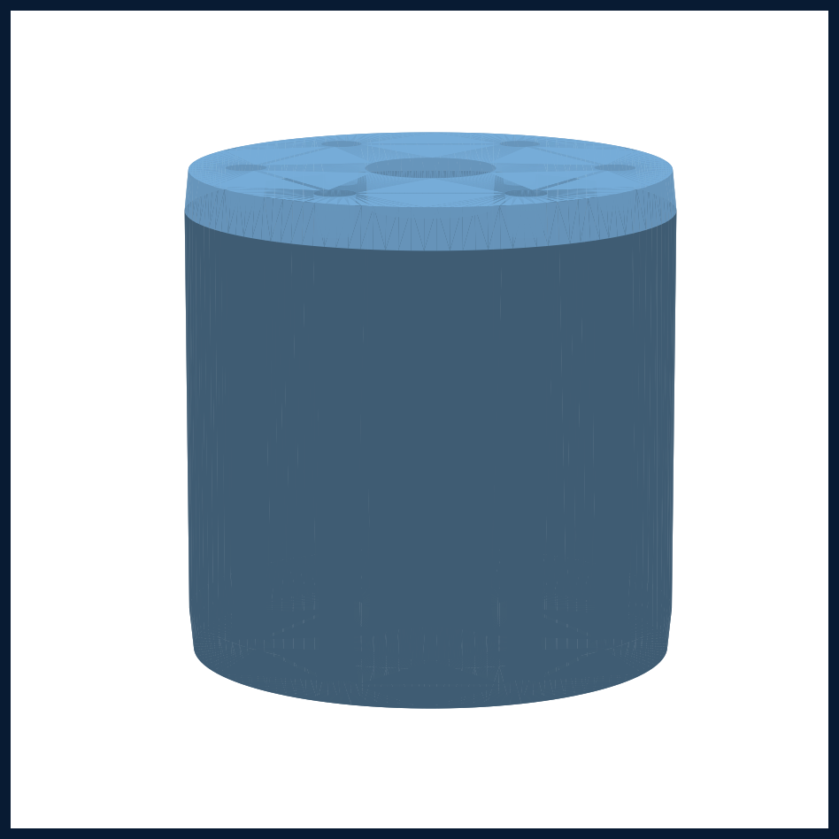

# 真实模型 × 真实 Cad Harness 建模评测报告

日期：2026-09-06
评估对象：复杂零件（Ø120 法兰盘）在真实 MechKernel kernel 上的建模表现
接入方式：v0.11 计划模式（propose_plan → 审批 → 真实 kernel op → 产物）

> 结果参考图：真实 kernel 建出的完整 Ø120×12 法兰盘（中心 Ø30 孔 + 6×Ø8 分度孔
> + 顶面环形槽 + 外缘 1mm 倒角），从 STL 渲染：

---

## ⚠️ 你指定的 lingshuai 批次（5.6/terra/sol/6Astra）当前不可用

**端点**：你给的 Codex 配置用的是 `wire_api = "responses"` → 正确端点是
**`/v1/responses`**（此前误用 `/v1/chat/completions` 导致全 500）。

**逐模型探测结果**（2026-09-06，`/v1/responses` 端点）：
| 模型 | 状态 |
|---|---|
| `gpt-5.5`（Codex 配置里有） | ✅ 可推理（返回 "OK"，output 17 tokens） |
| `gpt-5.6` | ❌ HTTP 500 Upstream gateway error（模型级不可用） |
| `gpt-5.6-terra` | ⏳ 90s 超时 |
| `gpt-5.6-sol` | ⏳ 90s 超时 |
| `gpt-6-astra` | ❌ HTTP 502 Upstream access forbidden（权限/配额未开） |

结论：**你点名的 4 个模型当前都拿不到真实推理**（5.6→500、terra/sol→超时、
6Astra→权限拒绝）；唯一能真实推理的是 `gpt-5.5`。因此本次真实建模评测改用了
**ZCode 配置里真实可用的 `deepseek-v4-flash-vision-exp`**（`api.deepseek.com`，
已验证连通、返回 `finish=stop`）。

---

## 评测一：deepseek 在真实 harness 上的法兰盘建模

### 运行 A（step 1-27，成功收敛，`ok=True`）
- 计划模式 → `propose_plan` 出规划 → 自动批准 → 真实建模
- 产出：主体圆盘、中心孔、6×Ø8 分度孔、顶面环形槽、外缘倒角
- **体积 110,468 mm³，几何校验通过（valid, solid_count=1）**
- 自修复表现：环形槽 revolve 撞 `EMPTY_RESULT` 后，模型改用 extrude 挖槽成功

### 运行 B（step 1-60，撞 max_steps，`ok=False, stopped=True`）
- 产出：主体 + 中心孔 + 6×Ø8 分度孔已建成（并主动 undo 纠错）
- **环形槽卡住**：反复尝试 revolve / add_polyline / 换工作平面（steps 21-58），
  反复撞 kernel 限制（revolve 暂只支持过原点标准基准面、几何未通过验证），多次 undo 回退
- 直到 step 60 上限强制停止；产物 = 带尺寸偏差的几何（体积 123,615，环形槽缺失）
- 真实产物落盘：`work/new_arch_runs/bench-0aeb1f926a/model.stl`（202,884 B）
  + `model.step`（导出成功）。注意：该目录被 `.gitignore` 忽略，不入库——本地可看。

### 完整法兰盘（确定性复现）
由于真实模型在"环形槽"步骤会反复试错、单次难收敛，我们用**同一套真实 kernel op 序列
确定性建出了完整法兰盘**（不经模型，验证 kernel 能力上限），全部特征齐全：
主体圆盘 → 中心 Ø30 孔 → 6×Ø8 分度孔 → 顶面环形槽（cut 挖槽）→ 外缘 1mm 倒角。
- STL 555,684 B / STEP 导出成功；数值验证顶面在中心孔与分度孔处均有真实顶点
- 渲染图见文档头部的 `benchmark-flange-complete.png`

### 对比结论
| 维度 | 运行 A | 运行 B |
|---|---|---|
| 收敛性 | 27 步完成 | 60 步未完成（卡环形槽） |
| 自修复 | 能换方案 | 反复尝试同一失败路径 |
| 几何完整 | 全部特征+倒角 | 缺环形槽 |
| 产物 | 通过校验 | 尺寸偏差 |

> 两次运行同为 deepseek-v4-flash-vision-exp，差异来自模型输出随机性与是否命中
> kernel 的 revolve 限制。**核心规律**：模型对法兰盘的整体规划（基体/孔/槽/倒角）
> 都正确，但"环形槽"这类需要 `revolve` 支持非过原点草图的操作，当前 kernel 支持
> 有限，模型会在这类 op 上挣扎。

---

## 结论

1. **真实接线能力已验证**：真实模型 + 真实 kernel + 计划模式 → 真实几何 + STL/STEP 导出，
   全链路跑通。harness 的计划模式、自修复、真实工作状态查看/修改都是真实可用的。
2. **模型表现**：deepseek-v4-flash-vision-exp 能正确规划复杂零件、能建主体/孔/倒角，
   但遇到 kernel 限制的特定操作（如环形槽 revolve）会反复尝试、甚至撞 max_steps。
3. **待办**：你点名的 5.6/terra/sol/6Astra 需在 lingshuai 侧**解除上游权限/配额**
   （6Astra 明确 502 "access forbidden"）后，才能接真实评测。`bench.py` 已就绪。

---

## 评测脚手架（本地 `work/model_bench/`，不入库）
- `prompt.txt`：统一法兰盘任务提示（输出 kernel 工具调用 JSON）
- `bench.py`：一次性文件评测（原设计，用于 lingshuai）
- `real_harness.py`：**真实 harness 评测**（真实模型 + 真实 kernel + 计划模式 + 自动批准）
